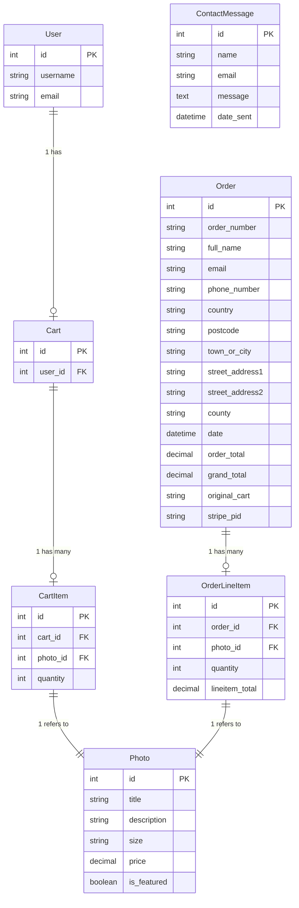

# [REALLY DEEP PHOTOGRAPHY](https://really-deep-photography-0f99271ef54c.herokuapp.com)

[](https://github.com/craigdickerson725/really-deep-photography/commits/main)
[](https://github.com/craigdickerson725/really-deep-photography/commits/main)
[](https://github.com/craigdickerson725/really-deep-photography)

Really Deep Photography is a carefully crafted online platform dedicated to showcasing and selling high-quality photography. With a focus on visually striking and professionally curated images, this site offers an accessible way for customers to explore, select, and purchase stunning photos for personal or professional use. Each image is available to preview in high resolution, allowing users to fully appreciate the details and artistic quality of the work before making a purchase.

This project aims to bridge the gap between photographers and art enthusiasts, providing a seamless, user-friendly experience for purchasing unique photographic artwork. It’s designed for a diverse audience, including art collectors, designers, and anyone with an eye for beautiful visuals. The site caters to both seasoned photography buyers and newcomers alike, offering an intuitive interface for easy browsing, a personalized shopping cart, and a secure, reliable checkout process.

In addition to serving art buyers, Really Deep Photography includes a range of tools for site administrators, including photo management features and photo curation tools. This platform empowers the staff and business owner to easily showcase their work, engage with buyers, and manage their inventory and featured items—all in one place.

source: [amiresponsive](https://ui.dev/amiresponsive?url=https://really-deep-photography-0f99271ef54c.herokuapp.com)

## User Experience (UX)
The "Really Deep Photography" website has been designed to offer an intuitive, streamlined user experience for both customers and site administrators. The layout and navigation prioritize ease of use, simplicity, and a minimalist aesthetic, making it straightforward for users to browse photos and make purchases.

### Site Navigation
The website's main navigation bar is present across all pages, offering quick links to essential sections:

- **Home:** A welcoming page that sets the tone for the brand with a hero section introducing the photography service and inviting users to explore the gallery.
- **Gallery:** Users can browse a selection of photos with options to view details and add items to their cart.
- **Cart:** Accessible from the navigation bar, the cart offers users a clear overview of selected items, with options to adjust quantities or remove items.
- **Checkout:** A simple checkout process integrated with Stripe provides a secure and efficient way to complete purchases.
- **About and Contact:** These pages provide additional information about the business and a means for users to reach out directly.
- **Navbar:** The navbar itself uses clear, recognizable icons (like a cart icon) and is fully responsive, making it easy to navigate on both mobile and desktop devices. A user authentication option is available on the navbar, offering a quick login/logout functionality, and an "Admin" link appears for authorized users in the admin group, streamlining access to site management features.

### Visual Design
The color scheme consists primarily of black and white tones, giving the site a sleek, modern look that keeps the focus on the photography content. Typography choices like "Playfair Display" and "Merriweather" provide a professional aesthetic, blending well with the minimalist design. The hero section on the homepage uses bold fonts and a prominent call-to-action button to engage visitors and encourage gallery exploration.

### Interactive Elements
Users can interact with photos through an add-to-cart functionality available on each photo’s detailed view. In the cart, quantity adjustment is straightforward, with plus and minus buttons next to each item, and changes are immediately reflected in the cart. This ensures a seamless shopping experience, with minimal effort required to modify selections.

### Checkout
The checkout process has been simplified to ensure that users can quickly and securely complete their purchases using Stripe, reducing friction in the purchase flow.

### Footer Design
The footer complements the site's aesthetic with a dark background, featuring a Facebook link and a Mailchimp email signup form. The signup form is styled to blend with the footer's design, providing a seamless, attractive appearance.

### Responsiveness and Accessibility
The website has been developed with a mobile-first approach, ensuring that content and interactive elements adjust gracefully across devices and screen sizes. The use of clear, high-contrast text and simple layout ensures readability, while form elements are designed for usability on touchscreens as well as desktops.

Overall, "Really Deep Photography" offers an accessible, visually appealing, and easy-to-navigate experience that allows users to focus on exploring and purchasing photos with ease.

## User Stories

### Customer User Stories

- As a customer I can browse a gallery of available photos so that I can choose which prints to purchase
- As a customer I can view details of a photo so that I can see a larger image and more information (e.g., description, dimensions, price)
- As a customer I can create an account so that I can log in to add/purchase items
- As a customer I can receive password reset emails so that I can regain access to my account if I forget my password
- As a customer I can search for specific photos or categories so that I can find something specific to buy
- As a customer I can review the items in my cart so that I can make sure I'm ready to checkout
- As a customer I can add a photo to my shopping cart so that I can purchase it later
- As a customer I can complete a checkout process so that I can purchase the selected photos
- As a customer I can receive an email confirmation after I make a purchase so that I have a record of my order

### Site Admin User Stories

- As a site admin I can upload new photos to the website so that customers can purchase them
- As a site admin I can manage existing photos (edit titles, prices, or remove them) so that my gallery stays up to date
- As a site admin I can view a list of all orders so that I can keep track of what has been sold and needs to be shipped
- As a site admin I can employ SEO strategies so that my website ranks higher in search results
- As a site admin I can integrate social media links so that I can promote my work easily

## Wireframes

### Mobile Wireframes

<details>
<summary> Click here to see the Mobile Wireframes </summary>

Home
  - 

About
  - 

Contact
  - 

Gallery
  - 

Cart
  - 

</details>

### Tablet Wireframes

<details>
<summary> Click here to see the Tablet Wireframes </summary>

Home
  - 

About
  - 

Contact
  - 

Gallery
  - 

Cart
  - 

</details>

### Desktop Wireframes

<details>
<summary> Click here to see the Desktop Wireframes </summary>

Home
  - 

About
  - 

Contact
  - 

Gallery
  - 

Cart
  - 

</details>

## Features

### Existing Features

#### Customer Features

- **Photo Gallery Browsing**

  - This feature provides a main gallery where customers can browse all available photos for sale. It serves as the primary landing point for users interested in purchasing, offering a visual overview of available prints.


- **Photo Details View**

  - Customers can click on individual photos to view a larger image along with details like description, dimensions, and price. This helps users make informed decisions by offering additional insights about each photo before purchase.


- **User Registration and Login**

  - The site allows customers to create an account and log in, giving them access to the features necessary for adding items to their shopping cart and completing the purchasing process. This feature also includes password reset functionality for account recovery.


- **Search Functionality**

  - The search bar allows customers to find specific photos or categories, saving time and enhancing the browsing experience for those with particular interests.


- **Shopping Cart**

  - Users can add photos to their cart and review the items before checkout. This feature helps them keep track of selected items and make adjustments prior to finalizing the purchase.


- **Secure Checkout Process**

  - The checkout feature allows customers to complete a purchase securely. It includes options for entering payment information and confirming the order, which then redirects them to an order confirmation page.


- **Email Order Confirmation**

  - After completing a purchase, customers receive a confirmation email with details of their order, providing them with a record of the transaction.


### Site Admin Features

- **Photo Management**

  - Admins can upload new photos, update titles and prices, or remove outdated images. This feature allows for easy gallery management to keep offerings fresh and current.


- **Order Management**

  - A dashboard provides admins with a list of all orders, allowing them to track sales and fulfill customer requests promptly.


- **SEO Implementation**

  - SEO elements, such as meta tags and page titles, have been implemented to improve site visibility in search results. This feature is crucial for reaching a wider audience and improving search engine ranking.


- **Social Media Integration**

  - Social media links in the footer and relevant pages make it easy for admins to promote photos across platforms, reaching more potential customers.


## Database Design

### Data Model

Entity Relationship Diagrams (ERD) help to visualize database architecture before creating models. Understanding the relationships between different tables can save time later in the project.


⚠️ INSTRUCTIONS ⚠️

Using your defined models, create an ERD with the relationships identified. A couple of recommendations for building your own free ERDs:
- [Lucidchart](https://www.lucidchart.com/pages/ER-diagram-symbols-and-meaning)
- [Draw.io](https://draw.io)

Looking for an interactive version of your ERD? Consider using a [`Mermaid flowchart`](https://mermaid.live). To simplify the process, you can ask ChatGPT (or similar) the following prompt:

> ChatGPT Prompt:
> "Generate a Markdown syntax Mermaid ERD using my Django models"
> [paste-your-django-models-into-ChatGPT]

I've already done yours for project, Really Deep Photography, below.

**NOTE**: A Markdown Preview tool doesn't show the interactive ERD; you must first commit/push the code to your GitHub repository in order to see it live in action.

⚠️ --- END --- ⚠️

I have used `Mermaid` to generate an interactive ERD of my project.



source: [Mermaid](https://mermaid.live/edit#pako:eNqdVFFv2jAQ_iuWnwGRkEKb106Tpm5apWkvU6ToGh9gLbEz-6KVAv99dgLUECqi5SXWfd99Z3939pYXWiBPOZpPElYGqkwx9_20aNi2W_tPKmJSsOen95AlI9WKNY6poMIegBXIsovuM9UtHsHQDVkf8pq5i39-OuUfs78QVgMUCkcNFY7xeq1JXwP-NKBI0uas4LNnD7PB5ZZ9DwTawsiapFY9zMq3IEFgISsoWW1kEYRftC4RFJM2XyJQY1BcWPrdiKGt0p6aq6Z6QdMDl01Z5rcaGUSdkwo_Eit0o8hs-knakh-4vn36r8q1yYtTC0KnyCBSDkIYtDa6gcfXdxPICiAkWWG76Legs4k0QdkH3RVR4hI8-StXUkGZ--m7tktZY17Lqx38KhUOnO1uf_8_3OFxSldWurLhid5vq1YEBX1zpsIKh83YkAkifCVWdaofdCW3qOhiO-2btNuNx3rXPSQpy3jE1mAzHjwvAaM19MRiFahNSG1hT9_tDle94xpcorFuJo_k7o4dhM_bdV39nHOrBB_xCo3zSLiHuHU547RGZyT3bAHmt6ftHQ8a0j82quApmQZHvKm9W4enm6dLKK2L1qB4uuWvPJ0l0eR-vojn0Wy6iKfTZDHiG56OZ5N5Es-SJL57WNzdxw_xYj_ib1o7jWgyjWZxkrg093NYq_erxbqiRjer9aHY_h-NUea4)

⚠️ RECOMMENDED ⚠️

Alternatively, or in addition to, a more comprehensive ERD can be auto-generated once you're at the end of your development stages, just before you submit. Follow the steps below to obtain a thorough ERD that you can include. Feel free to leave the steps below in the README for future use to yourself.

⚠️ --- END --- ⚠️

I have used `pygraphviz` and `django-extensions` to auto-generate an ERD.

The steps taken were as follows:
- In the terminal: `sudo apt update`
- then: `sudo apt-get install python3-dev graphviz libgraphviz-dev pkg-config`
- then type `Y` to proceed
- then: `pip3 install django-extensions pygraphviz`
- in my `settings.py` file, I added the following to my `INSTALLED_APPS`:
```python
INSTALLED_APPS = [
    ...
    'django_extensions',
    ...
]
```
- back in the terminal: `python3 manage.py graph_models -a -o erd.png`
- drag the new `erd.png` file into my `documentation/` folder
- removed `'django_extensions',` from my `INSTALLED_APPS`
- finally, in the terminal: `pip3 uninstall django-extensions pygraphviz -y`


source: [medium.com](https://medium.com/@yathomasi1/1-using-django-extensions-to-visualize-the-database-diagram-in-django-application-c5fa7e710e16)