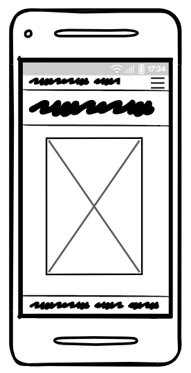
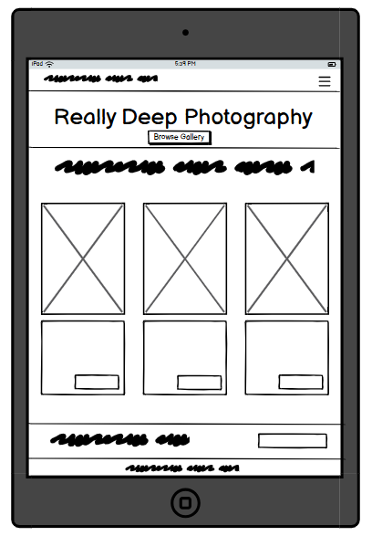

# [REALLY DEEP PHOTOGRAPHY](https://really-deep-photography-0f99271ef54c.herokuapp.com)

Really Deep Photography is a carefully crafted online platform dedicated to showcasing and selling high-quality photography. With a focus on visually striking and professionally curated images, this site offers an accessible way for customers to explore, select, and purchase stunning photos for personal or professional use. Each image is available to preview in high resolution, allowing users to fully appreciate the details and artistic quality of the work before making a purchase.

This project aims to bridge the gap between photographers and art enthusiasts, providing a seamless, user-friendly experience for purchasing unique photographic artwork. It’s designed for a diverse audience, including art collectors, designers, and anyone with an eye for beautiful visuals. The site caters to both seasoned photography buyers and newcomers alike, offering an intuitive interface for easy browsing, a personalized shopping cart, and a secure, reliable checkout process.

In addition to serving art buyers, Really Deep Photography includes a range of tools for site administrators, including photo management features and photo curation tools. This platform empowers the staff and business owner to easily showcase their work, engage with buyers, and manage their inventory and featured items—all in one place.

source: [amiresponsive](https://ui.dev/amiresponsive?url=https://really-deep-photography-0f99271ef54c.herokuapp.com)

